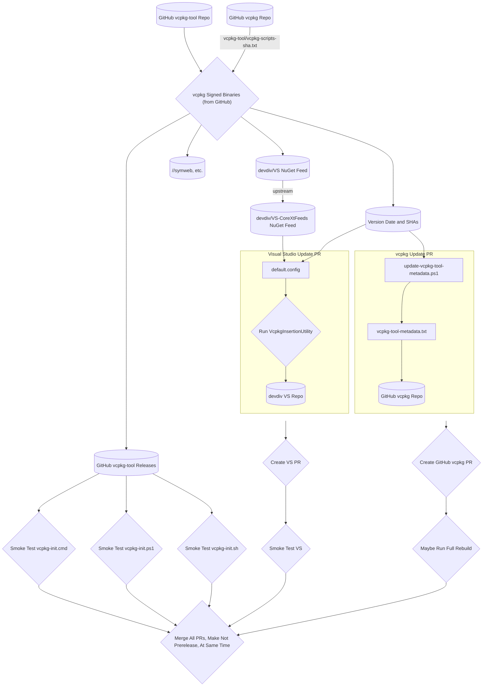

# vcpkg_tool_release_process

This document describes the acceptance criteria / process we use when doing a vcpkg-tool update,
such as https://github.com/microsoft/vcpkg/pull/23757

1. Run `$/vcpkg-init/update-scripts-sha.ps1` to update `$/vcpkg-init/vcpkg-scripts-sha.txt` to the
  current `master` branch SHA in the registry repo.
1. Verify that all tests etc. are passing in the vcpkg-tool repo's `main` branch, and that the
  contents therein are acceptable for release. (Steps after this will sign code there, so this
  review is responsible gating what has access to code signing.)
1. Check that the changes there are in fact the changes that we want in that release. (Be aware,
  you are responsible for what is about to be signed with a Microsoft code signing certificate by
  proceeding)
1. Submit a signed build from "vcpkg Signed Binaries (from GitHub)" (
  https://devdiv.visualstudio.com/DevDiv/_build?definitionId=17772&_a=summary as of this writing)
1. The signed build will automatically create a draft GitHub release at
  https://github.com/microsoft/vcpkg-tool/releases . Erase the contents filled in there and press
  the "auto generate release notes" button. Manually remove any entries created by the automated
  localization tools which will start with `* LEGO: Pull request from juno/`.
1. Publish that draft release as "pre-release".
1. Clean up a machine for the following tests:
    * Delete `VCPKG_DOWNLOADS/artifacts` (Windows) `HOME/.cache/vcpkg/downloads` (non-Windows)
      (which forces artifacts to be reacquired). (This is the path calculated in `VcpkgPaths` with
      `get_platform_cache_vcpkg().value_or_exit(VCPKG_LINE_INFO) / "downloads";`)
    * Delete `LOCALAPPDATA/vcpkg` (Windows) `HOME/.cache/vcpkg` (non-Windows) (which forces
      registries to be reacquired)
1. Smoke test the 'one liner' installer. Run these in an environment with VCPKG_ROOT unset;
  otherwise changes in your working repo there may be overwritten. Where 2025-03-22 is replaced
  with the right release name:
    * Powershell (Windows):
        `iex (iwr https://github.com/microsoft/vcpkg-tool/releases/download/2025-03-22/vcpkg-init.ps1)`
    * Batch (Windows):
        `curl -L -o vcpkg-init.cmd https://github.com/microsoft/vcpkg-tool/releases/download/2025-03-22/vcpkg-init.ps1 && .\vcpkg-init.cmd`
    * Bash (non-Windows):
        `. <(curl https://github.com/microsoft/vcpkg-tool/releases/download/2025-03-22/vcpkg-init -L)`
  (and test that `vcpkg use microsoft:cmake` works from each of these)
1. In the vcpkg repo, run `$/scripts/update-vcpkg-tool-metadata.ps1 -Date 2025-03-22`
  with the new release date, which updates SHAs as appropriate. Commit these changes and submit as a PR.
1. If changes in this release that might affect ports, submit a new full tree rebuild by
  microsoft.vcpkg.ci (https://dev.azure.com/vcpkg/public/_build?definitionId=29 as of this writing)
  targeting `refs/pull/NUMBER/head`
1. (Probably the next day) Check over the failures and ensure any differences with the most recent
  full rebuild using the previous tool version are understood.
1. Create a new task in the DevDiv VS instance for this release. (PRs into VS require an associated work
   item in order to be merged.)
1. Download the VS-insertion .nupkg from the "vcpkg Signed Binaries (from GitHub)" run.
1. In the DevDiv VS repo ( https://devdiv.visualstudio.com/DefaultCollection/DevDiv/_git/VS ),
   update `src/ConfigData/Packages/Redist/Setup.props` with the version number from the name of the
   nupkg:
   `<PackageVersion Include="VS.Redist.Vcpkg.amd64" Version="1.0.0-2025-02-11-bec4296bf5289dc9ce83b4f5095943e44162f9c2" />`
1. The first time you try to do a VS update on a machine, clone the VS repo, and open a text editor
   go to `$/src/vc/projbld/Vcpkg/VcpkgInsertionUtility/Program.cs`, and look for the command line
   in a comment to build it. Open a developer command prompt, go to
   `$/src/vc/projbld/Vcpkg/VcpkgInsertionUtility` and run that command.
1. Run `src/vc/projbld/Vcpkg/VcpkgInsertionUtility/Program.exe path-to-VS-insertion-nupkg`
1. Submit this as a change to the VS repo. Example: https://devdiv.visualstudio.com/DefaultCollection/DevDiv/_git/VS/pullrequest/498110
   Don't forget to attach the work item number from the previous step.
1. Smoke test the copy of vcpkg inserted into VS. See smoke test steps below. The prototype copy is
  at "CloudBuild - PR -> Extensions\VS Enterprise\Release Channel" as of 2023-10-19 but this UI
  changes frequently.
1. (After all tests have passed, at the same time) Merge both PRs, and change the github release
  in vcpkg-tool from "prerelease" to "release". (This automatically updates the aka.ms links)
1. Mark any `requires:vcpkg-tool-release` issues as fixed by the tool release.

# Release Data Flow



* [vcpkg Signed Binaries (from GitHub)](https://devdiv.visualstudio.com/DevDiv/_build?definitionId=17772&_a=summary) Uses the azure-pipelines/signing.yml file in the vcpkg-tool repo.
* [devdiv/VS NuGet Feed](https://devdiv.visualstudio.com/DefaultCollection/DevDiv/_artifacts/feed/VS/NuGet/VS.Redist.Vcpkg.amd64/)
* [devdiv/VS-CoreXtFeeds NuGet Feed](https://devdiv.visualstudio.com/DefaultCollection/DevDiv/_artifacts/feed/VS-CoreXtFeeds/NuGet/VS.Redist.Vcpkg.amd64/)
* [devdiv VS Repo](https://devdiv.visualstudio.com/DefaultCollection/DevDiv/_git/VS)
* Run Full Rebuild: Queue a [microsoft.vcpkg.ci](https://dev.azure.com/vcpkg/public/_build?definitionId=29) run for `refs/pull/NUMBER/head`
  * Example: https://dev.azure.com/vcpkg/public/_build/results?buildId=73664&view=results

# Smoke Testing VS

1. Install the prototype version of VS with the vcpkg inserted. Ensure the native desktop workload is selected, and that vcpkg and cmake bits are installed. Don't forget about preinstall. ( `https://aka.ms/VSPreinstall` ? )
1. Open a developer command prompt and run `vcpkg integrate install` (this step hopefully removed soon)
    * This also verifies that vcpkg installed into the developer command prompt correctly.
1. Create a new C++ console project.
1. Turn on diagnostic logging.
    * Tools -> Options: Projects and Solutions\Build and Run\\MSBuild project output verbosity
1. Build the console project, check that vcpkg isn't affecting that project:
    * Lib AdditionalLibraryDirectories doesn't contain a hypothetical vcpkg installed directory
    * Target VcpkgInstallManifestDependencies doesn't run
    * Target AppLocalFromInstalled doesn't run
1. In the developer command prompt cd to the directory with the vcxproj for the console app and run:
    ```
    vcpkg new --application
    vcpkg add port zlib
    ```
1. Rebuild the console app, and verify the manifest mode warning is printed:
    ```
    1>Target "VcpkgCheckManifestRoot" in file "C:\Program Files\Microsoft Visual Studio\2022\Preview\VC\vcpkg\scripts\buildsystems\msbuild\vcpkg.targets":
    1>  Task "Error" skipped, due to false condition; ('$(VcpkgEnableManifest)' == 'true' and '$(_ZVcpkgManifestRoot)' == '') was evaluated as ('false' == 'true' and 'C:\Users\bion\source\repos\ConsoleApplication3\ConsoleApplication3\' == '').
    1>  Task "Message"
    1>    Task Parameter:Importance=High
    1>    Task Parameter:Text=The vcpkg manifest was disabled, but we found a manifest file in C:\Users\bion\source\repos\ConsoleApplication3\ConsoleApplication3\. You may want to enable vcpkg manifests in your properties page or pass /p:VcpkgEnableManifest=true to the msbuild invocation.
    1>    The vcpkg manifest was disabled, but we found a manifest file in C:\Users\bion\source\repos\ConsoleApplication3\ConsoleApplication3\. You may want to enable vcpkg manifests in your properties page or pass /p:VcpkgEnableManifest=true to the msbuild invocation.
    1>  Done executing task "Message".
    ```
1. Right click the console application, properties, and in the property pages change vcpkg\\Use vcpkg Manifest to "Yes"
1. Rebuild the project, observe vcpkg builds zlib.
1. Change the .cpp to:
    ```
    #include <iostream>
    #include <zlib.h>

    int main()
    {
        std::cout << "Hello World!\n" << ZLIB_VERSION;
    }
    ```
1. Run the program and verify that a reasonable zlib version is printed.
1. Close Visual Studio.
1. In the directory of that vcxproj, create a CMakeLists.txt with the following content:
    ```
    cmake_minimum_required(VERSION 3.24)
    project(console-app LANGUAGES CXX)
    message(WARNING "CMake Version is ${CMAKE_VERSION}")
    find_package(ZLIB REQUIRED)
    file(GLOB PROGRAM_SOURCES *.cpp)
    add_executable(program ${PROGRAM_SOURCES})
    target_link_libraries(program PRIVATE ZLIB::ZLIB)
    ```
1. Back in the developer command prompt, run:
    ```
    cmake -G Ninja -DCMAKE_TOOLCHAIN_FILE="%VCPKG_ROOT%\scripts\buildsystems\vcpkg.cmake" -S . -B build_msvc
    ninja -C build_msvc
    build_msvc\program.exe
    ```
    and check that a reasonable zlib version is printed.
1. Back in the developer command prompt, verify that the copy of CMake can be customized by running:
    ```
    vcpkg-shell use microsoft:cmake
    cmake -G Ninja -DCMAKE_TOOLCHAIN_FILE="%VCPKG_ROOT%\scripts\buildsystems\vcpkg.cmake" -S . -B build_artifact
    ninja -C build_artifact
    build_artifact\program.exe
    ```
    and check that the cmake version acquired by artifacts is printed during the cmake configure, and that a reasonable zlib version is printed.
1. Close Visual Studio.
1. Back in the developer command prompt, run:
    ```
    vcpkg add artifact microsoft:cmake
    ```
1. Open Visual Studio and use "Open Folder" on the directory containing the vcxproj. Verify that vcpkg activation happens in the terminal.
